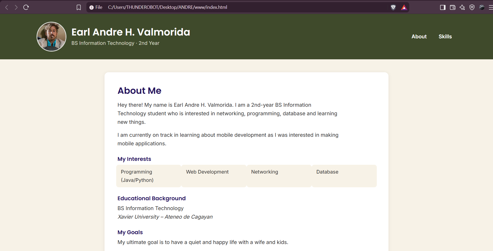
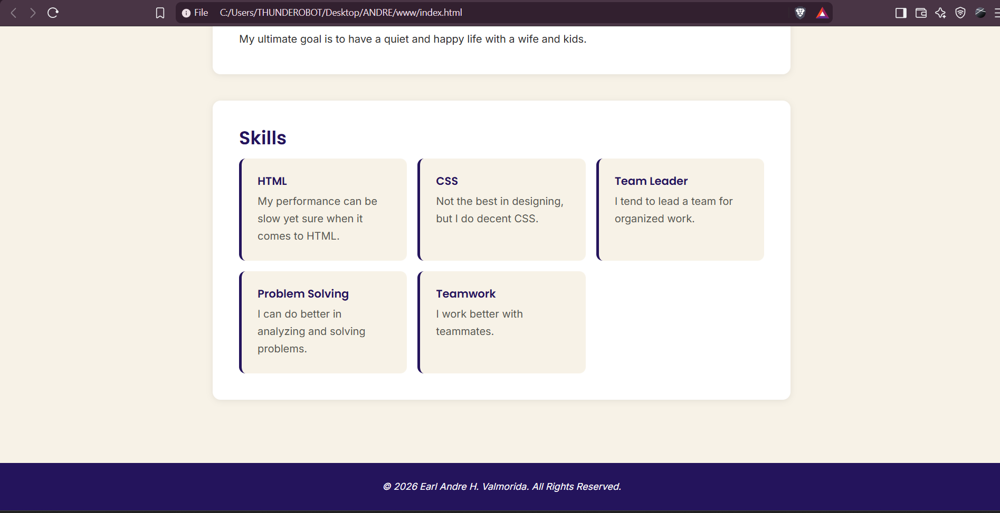
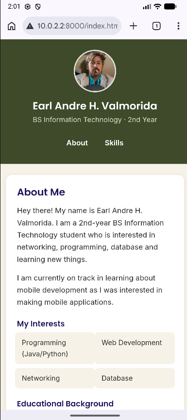
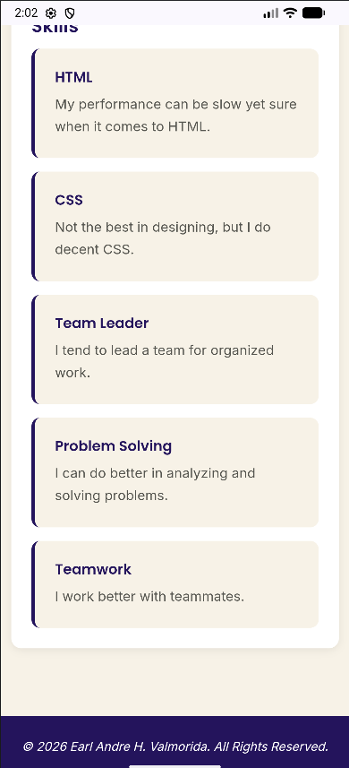
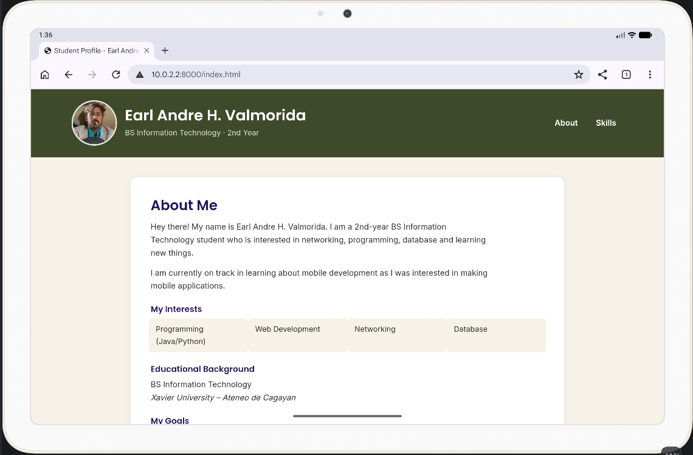
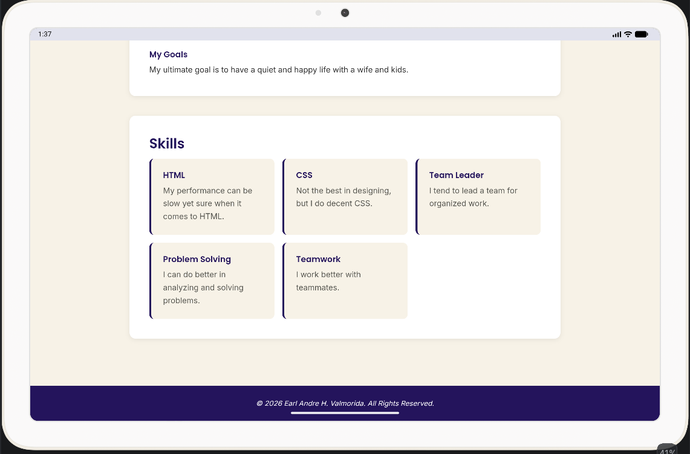

# Student Profile Website

## Screenshots

### Screenshot 1: Desktop

### Screenshot 2: Phone

### Screenshot 3: Tablet

## Technologies Used

- HTML5
- CSS3
- Bootstrap 5 (For responsive design)
- Google Fonts (For consistent fonts)

## Features

- Responsive student profile layout
- About Me section
- Interests section
- Educational Background
- Goals section
- Skills section
- Responsive design for different screen sizes

## Author

**Earl Andre H. Valmorida**

BS Information Technology 3  
ITCC 41 A
