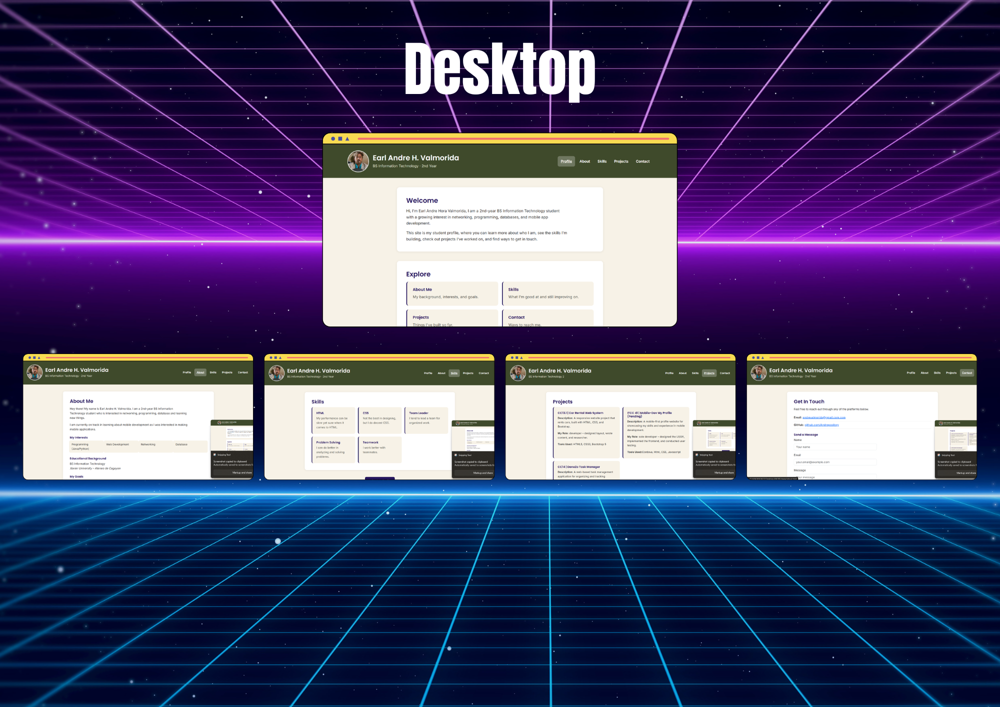
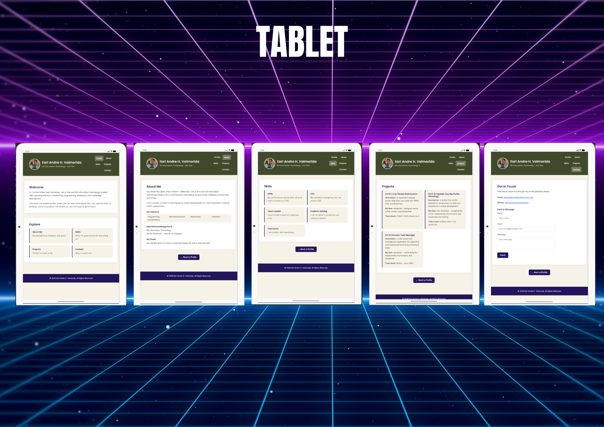
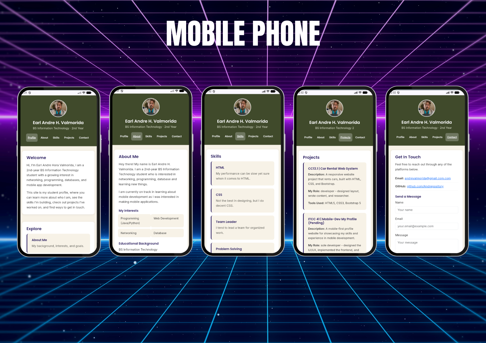

# Multi-Page Student Profile Website
    Earl Andre H. Valmorida | ITCC41 A

## 1. Project Description

This is a multi-page Student Profile application for Earl Andre H. Valmorida, a 3rd-year BS Information Technology student. Built with HTML5, CSS3, and Bootstrap 5, and packaged as a native Android app using Apache Cordova, it presents a personal profile across five dedicated pages: Profile, About, Skills, Projects, and Contact.

## 2. Application Pages

- **Profile (`index.html`)** – The landing page. Provides a short welcome/introduction and an "Explore" section with quick links into the other four pages.
- **About (`about.html`)** – Personal background, interests, educational background, and personal goals.
- **Skills (`skills.html`)** – A breakdown of technical and soft skills (HTML, CSS, Team Leadership, Problem Solving, Teamwork), each with a short self-assessment.
- **Projects (`projects.html`)** – A showcase of coursework projects, including this Cordova mobile profile app itself, with description, role, and tools used for each.
- **Contact (`contact.html`)** – Contact details (email, GitHub) and a message form for reaching out.

## 3. Navigation

Every page shares the same header containing a navigation bar (`<nav>` with a list of `<a href="...">` links to `index.html`, `about.html`, `skills.html`, `projects.html`, and `contact.html`). The application uses standard HTML links to navigate between pages — there is no single-page routing or JavaScript navigation logic. The link for the currently active page is visually highlighted with an `active` class and marked with `aria-current="page"`. Each interior page also includes a "Back to Profile" link for quick return to the home page.

## 4. Responsive Design

The application is built on Bootstrap 5 grid system, which handles responsiveness across screen sizes:

- Desktop – Full multi-column layout; navigation links display inline in the header; content cards and grids (skills, projects, interests) display in multiple columns.
- Tablet – Grid columns adjust (e.g. `row-cols-sm-2`), and the header remains horizontal with balanced spacing.
- Mobile – Layout stacks vertically (`flex-column flex-sm-row` on the profile header), grid items collapse to single or double columns, and navigation remains accessible and tappable without horizontal scrolling.

## 5. UI/UX Principles Applied

Following Module 4 UI/UX principles, the design maintains:

- Consistency – The same header, navigation, color scheme (olive green header, cream background, purple accents), and footer appear identically across all five pages.
- Accessibility – A "Skip to main content" link, `aria-label` on navigation, `aria-current="page"` on the active link, and descriptive `alt` text on the profile image.
- Usable, spaced-out controls – Bootstrap form components with labeled inputs on the Contact page; card-based layout with adequate spacing and touch-friendly targets.

## 6. How to Run

1. From the project root, prepare the Android platform:
   ```
   cordova prepare android
   ```
2. Run the app on an emulator or physical device:
   ```
   cordova run android
   ```
  

## 7. Application Screenshots

### Desktop


### Tablet


### Mobile


## Technologies Used

- HTML
- CSS
- Bootstrap 5 (for responsive design)
- Google Fonts (for consistent typography)
- Apache Cordova 

## Author

**Earl Andre H. Valmorida**
BS Information Technology 3
ITCC 41 A
