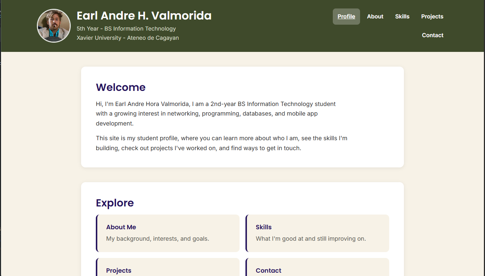
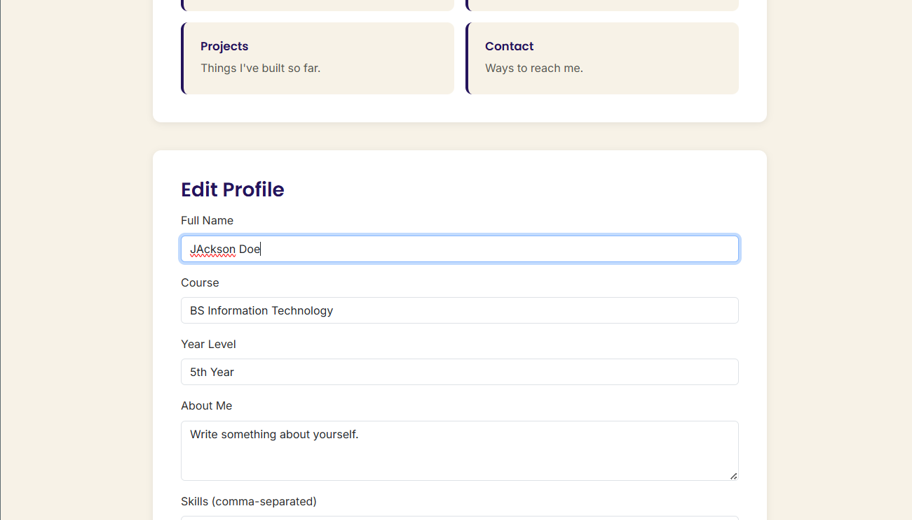
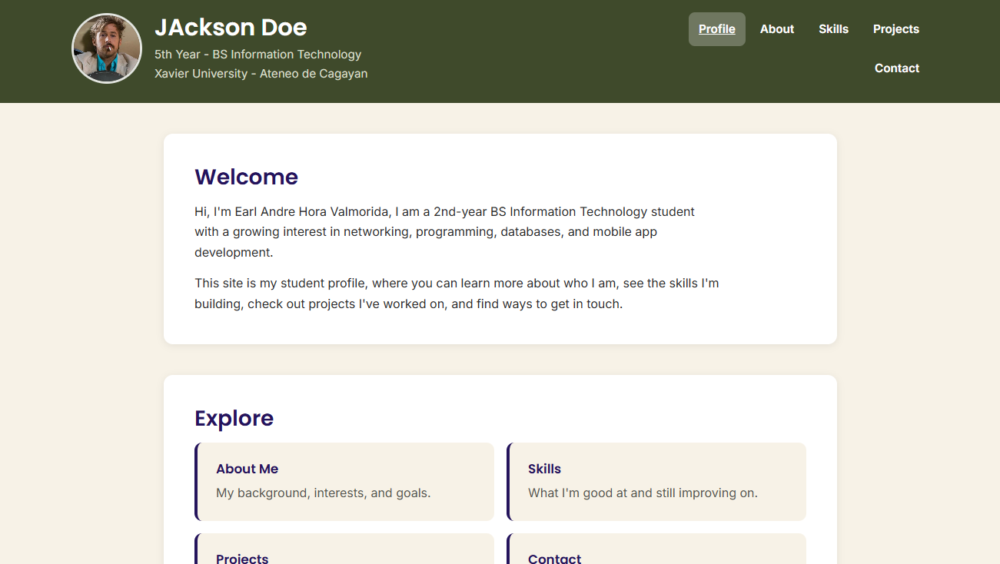
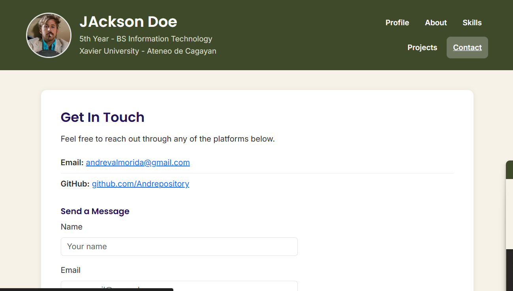

# Multi-Page Student Profile Website

**Earl Andre H. Valmorida - ITCC41 A**

---

## Project Description

This is my multi-page Student Profile application. The site is built with HTML5, CSS3, and Bootstrap 5, packaged as a Cordova application. The Profile page now includes a fully functional Edit Profile feature that lets the user update their personal information directly through the app, with all changes saved using the browser's localStorage so they persist across sessions.

## Application Pages

- **Profile** (index.html) 
- **About** (about.html) 
- **Skills** (skills.html)
- **Projects** (projects.html) 
- **Contact** (contact.html) 

## 3. Profile Editing

On the Profile page, the Student Profile card displays the student's current Full Name, Course, Year Level, About Me, and Skills, along with an Edit Profile button.

When you click Edit Profile:
- It Shows an editing form pre-filled with the current profile values.

The Edit Profile form allows the user to modify:
- Full Name
- Course
- Year Level
- About Me
- Skills 

The form has two actions:
- Save — validates the input, stores the updated profile, and updates the displayed profile card with the new information.
- Cancel — discards any changes made in the form and returns to the profile view with the previous information.

## 4. JavaScript Functionality

JavaScript (index.js) drives all of the dynamic behavior on the Profile page:

header-sync.js is included on the About, Skills, Projects, and Contact pages. It reads the saved profile from localStorage on page load and updates the name, course, and year shown in the header, so the student's information stays consistent across every page of the site.

## 5. Local Data Storage

The application uses the browser's localStorage to store profile data between sessions.

## 6. Responsive Design

The application uses Bootstrap 5's responsive grid system along with custom CSS to remain usable across screen sizes:

## 7. How to Run

1. Make sure Node.js and the Cordova CLI are installed:
   npm install -g cordova
   
2. Clone this repository and navigate into the project folder:
   git clone https://github.com/Andrepository/Valmorida_StudentProfile.git
   cd Valmorida_StudentProfile

3. Install project dependencies 
   
4. Add a platform 
   
5. Build and run the application:
   cordova run android
   

For quick testing of the HTML/CSS/JavaScript without a full Cordova build, the files inside the `www` folder can be opened directly in a browser (e.g. double-click www/index.html).

##Screenshots

## Student Profile

## Edit Profile

## Updated Profile

## Contact

